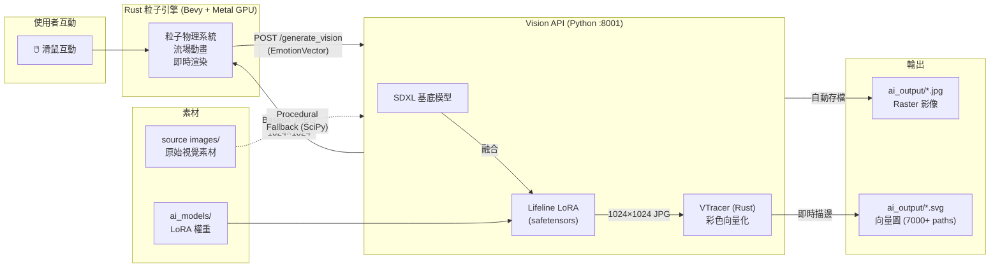

# Project Life Line

## 專案概述 (Project Overview)
「Life Line」是一個即時互動的科技藝術裝置，結合 **AI 影像生成**與 **粒子物理引擎**，將 AI 生成的畫作轉化為可互動的「活的畫布」——數十萬粒子隨著滑鼠與有機流場四處流動。

## 下載 (Download)

> **📦 [下載 Life Line v1.1.0 (.dmg, ~708MB)](https://github.com/chenweichiang/Life-line/releases/tag/v1.1.0)**

### 安裝方式
1. 下載 `LifeLine-v1.1.0.dmg`
2. 雙擊開啟 DMG
3. 將 **Life Line** 拖入 **Applications** 資料夾
4. 從 Launchpad 或 Applications 中開啟
5. 首次啟動會自動下載 SDXL 基底模型（~6GB），需要網路連線
6. 模型載入完成後即可輸入文字生成 AI 藝術圖

### 常見問題 (FAQ)

**Q: 開啟時顯示「Life Line 檔案已損毀，您應該將它丟到『垃圾桶』」？**
A: 這是 macOS Gatekeeper 對未經 App Store 認證的開源軟體的安全保護機制（隔離屬性）。
解決方式：打開「終端機 (Terminal)」，貼上以下指令並按 Enter 即可正常開啟：
```bash
xattr -cr /Applications/LifeLine.app
```

## 系統需求 (System Requirements)

| 項目 | 最低需求 | 建議配置 |
|------|---------|---------|
| **作業系統** | macOS 13+ (Ventura) | macOS 14+ (Sonoma) |
| **處理器** | Apple M1 | Apple M4 Max |
| **統一記憶體** | 16GB | 36GB+ |
| **GPU** | Metal 支援（M 系列內建） | Metal 3（M4 系列） |
| **磁碟空間** | 15GB（模型 + 基底） | 30GB+（含訓練資料集） |
| **Python** | 3.10+ | 3.11 |
| **Rust** | 1.75+ | 最新 stable |
| **Git LFS** | 必須（模型 435MB） | — |

> [!NOTE]
> - SDXL 基底模型載入約需 **6GB 記憶體**，推論時峰值約 **10GB**
> - 粒子引擎在 `GRID_STEP=1` 時會生成 **百萬級粒子**，需要 Metal GPU 加速
> - 目前僅支援 **Apple Silicon Mac**（MPS 後端），NVIDIA GPU 需修改 `main.py` 改用 CUDA
> - Windows / Linux 使用者需改用 Docker 部署（參考 `docker/` 目錄）

## 系統架構 (System Architecture)



### 元件說明

| 元件 | 路徑 | 技術 | 功能 |
|------|------|------|------|
| **Rust 粒子引擎** | `engine_rust/` | Bevy + Metal GPU | 即時粒子渲染、滑鼠互動、有機流場 |
| **Vision AI API** | `api_vision_python/` | FastAPI + SDXL + LoRA | AI 影像生成，回傳 Base64 JPEG |
| **SVG 向量化引擎** | `api_vision_python/` | VTracer (Rust bindings) | 將 raster 影像轉為高品質 SVG |
| **微分渲染器** | `api_vision_python/diffvg_torch.py` | 純 PyTorch | 實驗性微分向量渲染器（備援） |
| **AI 模型** | `ai_models/` | Kohya LoRA 訓練 | 訓練好的 Lifeline.safetensors |
| **Docker** | `docker/` | Docker Compose | 容器化部署環境 |
| **原始素材** | `source images/` | JPG | LoRA 訓練素材（已完成訓練） |
| **生圖輸出** | `ai_output/` | JPG + SVG | AI 生成圖片與向量圖自動存檔 |

---

## AI 生圖系統 (Vision AI Generation)

### 雙輸出架構：JPG (Raster) + SVG (Vector)

本專案支援兩種輸出格式，適用於不同的應用場景：

| 格式 | 生成方式 | 耗時 | 用途 |
|------|---------|------|------|
| **JPG (1024×1024)** | SDXL + LoRA 直接生成 | ~40s | 粒子引擎素材、網頁展示、社群分享 |
| **SVG (7000+ paths)** | SDXL 生成 → VTracer 向量化 | ~42s | Bevy 即時動畫、無損縮放、印刷輸出 |

> [!IMPORTANT]
> SVG 並非用微分渲染器「從零雕刻」，而是先讓 SDXL 生成完整的高品質 raster，再由 VTracer（Rust 引擎）以影像描邊演算法將其轉為貝茲曲線向量圖。這確保了 SVG 的視覺品質與 raster 完全一致。

### 模型配置
- **基底模型**：`stabilityai/stable-diffusion-xl-base-1.0` (SDXL)
- **LoRA 權重**：`ai_models/loras/output/Lifeline.safetensors`
- **LoRA Scale**：`0.4`（降低以釋放構圖多樣性，1.0 會過度強制波浪線條風格）
- **推論後端**：Apple MPS (Metal Performance Shaders)
- **輸出尺寸**：1024×1024
- **推論步數**：15~30 步（隨 intensity 動態調整）
- **Guidance Scale**：7.0~10.0（隨 intensity 動態調整）
- **VTracer 版本**：0.6.15（Rust 核心，Python bindings）

### API 端點

#### 1. 生成 Raster (JPG)
```
POST http://127.0.0.1:8001/generate_vision
```
回傳 Base64 編碼的 JPEG 影像。

#### 2. 生成向量圖 (SVG)
```
POST http://127.0.0.1:8001/task/generate_svg
```
背景執行：SDXL 生圖 → VTracer 向量化 → SVG 檔案。回傳 task_id 與檔案路徑。

#### 請求參數 (EmotionVector)

| 參數 | 型別 | 範圍 | 說明 |
|------|------|------|------|
| `intensity` | float | 0.0~1.0 | 影響推論步數和 guidance scale |
| `color_tone` | string | `warm` / `cool` / `earthy` | 預設模式的色調選擇 |
| `flow` | string | `chaotic` / `calm` | 預設模式的動態風格 |
| `custom_prompt` | string | 任意文字（可留空） | **自訂 prompt（最重要的參數）** |

### Prompt 工程指南 (Prompt Engineering Guide)

#### 觸發詞
所有 prompt 都會自動加上 `lifeline_art_style,` 前綴。這是 LoRA 訓練時的觸發詞。

#### LoRA 風格特徵
Lifeline LoRA 學到的核心視覺特徵：
- **有機流動線條**：波浪狀、流線形的線條是最強的 DNA
- **中心對稱構圖**：傾向從中心向外擴散
- **剪紙/浮雕質感**：線條有厚度和層次

#### 有效的 Prompt 策略

##### ✅ 能產生好結果的用語
| 類型 | 有效用語範例 | 效果 |
|------|------------|------|
| **多色衝撞** | `fragments of ruby red cobalt blue emerald green and golden amber` | 單張圖多色混搭 |
| **自然現象** | `volcanic delta`, `wildfire`, `coral reef`, `aurora` | 產生有機且生動的構圖 |
| **材質模擬** | `oxidized copper`, `rust patina`, `woven textile` | 突破波浪線條的框架 |
| **爆裂/碎裂** | `shattered glass`, `explosion`, `fragments flying outward` | 打破中心對稱 |
| **對比衝突** | `magma meets glacial ice`, `fire vs forest` | 同畫面內的雙元素對決 |
| **具體色彩名** | `turquoise`, `vermillion`, `cobalt blue`, `saffron yellow` | 比抽象色調更精確 |

##### ❌ 效果不佳的用語
| 類型 | 避免用語 | 原因 |
|------|---------|------|
| **水平帶狀** | `horizontal layers`, `landscape bands` | LoRA 會將其扭曲成波浪 |
| **同心圓** | `concentric rings`, `circular pattern` | 被拉成中心對稱的拉花 |
| **極簡留白** | `minimal`, `single line`, `empty space` | LoRA 傾向填滿整個畫面 |
| **網格/節點** | `network`, `grid`, `nodes and edges` | 無法突破曲線的限制 |
| **寫實題材** | `photorealistic`, `mountain`, `cityscape` | LoRA 風格太強會蓋掉 |

##### 🎯 Prompt 範本（已驗證的高品質配方）

```python
# 🔥 爆裂碎片 — 非對稱動態（高評分）
"explosive radial burst from center, sharp angular fragments, turquoise coral and gold on charcoal, broken glass mosaic"

# 🌈 稜鏡光譜 — 全彩繽紛（高評分）
"shattered glass prism refracting light into vivid rainbow spectrum, sharp angular shards of red orange yellow green blue violet on jet black"

# 🗺️ 地形迷宮 — 密集結構（高評分）
"aerial topographic map, contour lines of varying thickness, alternating bands of deep indigo and bright saffron yellow"

# 🎪 撕裂拼貼 — 大膽撞色（高評分）
"torn paper collage with rough edges, overlapping layers: newspaper print, solid vermillion, striped teal, dadaist assemblage"

# 🐚 珊瑚礁斷面 — 有機混色
"cross-section of coral reef, coral pink and tangerine polyps among indigo and jade green sea structures, dense organic complexity"

# 🔥🌲 野火地圖 — 衝突構圖
"satellite view of wildfire, intense red-orange flame fronts, black charred zones, untouched emerald green forest"

# 💎 彩色玻璃碎裂 — 多色聚合
"stained glass window being shattered, fragments of ruby red cobalt blue emerald green and golden amber, sacred geometry"

# 🦑 銅鏽銹蝕 — 材質突破
"extreme macro of oxidized copper surface, vivid verdigris turquoise patches against raw burnt copper orange, chemical reaction"
```

##### 🔬 科技 × 有機融合配方（已驗證高品質）

> LoRA 的有機流動 DNA 與科技語彙碰撞時，會產生極具張力的視覺效果。
> 關鍵策略：用科技結構（電路、量子、全息）作為骨架，讓 LoRA 的有機線條去「入侵」它。

```python
# 🌃 賽博城市脈動 — 街道化為霓虹血管（高評分）
"aerial view of cyberpunk city grid, streets as flowing veins of neon light, buildings as circuit components, hot pink and electric blue on charcoal"

# 🏙️ 生物發光巷弄 — 城市有機體特寫（高評分）
"cyberpunk alleyway with walls covered in bioluminescent circuit patterns, neon veins pulsing through concrete, rain-soaked reflections of hot pink and electric cyan"

# 🏔️ 數位山水 — 水墨遇上量子（高評分）
"traditional mountain landscape dissolving into digital pixels and data particles, ink wash flowing into glitch art, jade green and silver on black"

# ☁️ 雲海量子化 — 禪意遇上科技
"sea of clouds viewed from mountain peak, clouds fragmenting into geometric voxels and data cubes, golden sunrise light piercing through digital fog"

# 🚀 太空站心臟 — 太空建築的生命感（高評分）
"space station core shaped like beating heart, corridors as arteries flowing with light, cosmic nebula background, ruby red and stellar blue"

# 🪼 太空水母 — 透明宇宙生物
"colossal space creature with transparent body revealing internal architecture of corridors and reactors, veins of plasma flowing through crystalline skeleton, cosmic jellyfish"

# ☀️ 核融合心跳 — 能量脈動特寫
"extreme close-up of fusion reactor core pulsing like a heart, magnetic containment rings as arteries, plasma tendrils reaching outward like capillaries, intense orange white and electric blue"

# 🤖 AI 意識覺醒 — 數位面孔浮現（高評分）
"artificial intelligence awakening, abstract face emerging from ocean of flowing data streams and fiber optics, golden light breaking through indigo digital fog"

# 👥 群體意識 — 多重面孔共振
"collective AI consciousness, multiple translucent faces overlapping and merging, shared neural pathways flowing between them like rivers of light, aurora borealis palette on void black"

# 🏛️ AI 思維大教堂 — 資料結構宮殿
"inside an artificial mind, vast cathedral of floating data structures and memory palaces, thought pathways as flowing golden ribbons connecting crystalline nodes"

# 🌳 光纖宇宙樹 — 科技生命樹（高評分）
"cosmic world tree made of fiber optic cables, branches transmitting light pulses, roots diving into motherboard earth, electric cyan amber and violet"

# ⛏️ 電路板地層 — 科技考古學
"roots of cosmic tree penetrating deep underground layers of ancient circuit boards and fossilized microchips, geological cross-section meets technology archaeology, amber copper and emerald"

# 🌌 星系樹冠 — 宇宙尺度的有機結構
"canopy of world tree where each leaf is a tiny galaxy, branches as dark matter filaments connecting star clusters, cosmic scale organic structure, deep indigo gold and nebula pink"
```

#### 隨機修飾詞系統
每次生成會從以下 12 個修飾詞中隨機抽取 2 個，增加同一 prompt 的變化：
- `dense layered textures` / `ethereal transparent washes`
- `bold impasto strokes` / `delicate ink-like lines`
- `deep saturated pigments` / `luminous translucent layers`
- `raw expressive marks` / `meditative repetitive patterns`
- `dramatic chiaroscuro` / `soft diffused atmosphere`
- `fractured geometric forms` / `fluid watercolor bleeding`

#### Negative Prompt
固定使用：`photorealistic, 3d render, text, watermark, blurry, low quality`

---

## Rust 粒子引擎 (Particle Engine)

### 核心參數

| 參數 | 目前值 | 說明 |
|------|--------|------|
| `GRID_STEP` | 1 | 像素取樣密度（1=每個像素一粒子） |
| 排斥半徑 | 50.0 | 滑鼠互動的影響範圍 |
| 排斥力 | 2000.0 | 滑鼠推開粒子的力量 |
| Z 彈力 | 800.0 | 粒子被推開後的 Z 軸反彈 |
| 流場振幅 | 80.0 / 60.0 | X/Y 方向的有機流動強度 |
| 阻尼 | 0.98 | 速度衰減（越接近 1 越滑順） |
| 復原力 | 1.0 | 拉回目標位置的力道 |
| 漂移強度 | 30.0 / 20.0 | 目標位置隨時間飄移的幅度 |

### 運作流程
1. 啟動時呼叫 Vision API 取得 AI 生成圖
2. 將圖解析為 RGB 像素資料
3. 每個像素建立一個 3D 粒子（位置 = 像素座標，顏色 = RGB）
4. Update 迴圈：
   - 計算有機流場（多層正弦波疊加）
   - 處理滑鼠互動（排斥力場）
   - 更新粒子位置 + 阻尼
   - 同步到 Bevy Mesh

---

## 快速開始 (Getting Started)

### 一般使用者
直接[下載 DMG](https://github.com/chenweichiang/Life-line/releases/tag/v1.1.0)，雙擊安裝即可使用。

### 開發者

#### 方法一：腳本安裝
```bash
git clone https://github.com/chenweichiang/Life-line.git
cd Life-line
git lfs pull          # 下載 AI 模型（435MB）
./install.sh          # 自動安裝所有依賴 + 編譯 App
./run.sh              # 啟動 AI 後端 + SwiftUI App
```

#### 方法二：手動啟動
```bash
# 1. 啟動 Vision API
cd api_vision_python && source .venv/bin/activate
uvicorn main:app --port 8001
# 等待 "✅ SDXL + LoRA model ready!" 出現

# 2. 啟動 SwiftUI App（另一個終端機）
cd app_macos && swift run

# 3. 啟動粒子引擎（可選，另一個終端機）
cd engine_rust && cargo run --release
```

#### 打包 DMG
```bash
./build_dmg.sh   # 編譯 + 打包 Python 環境 + 模型 → build/LifeLine-v1.1.0.dmg
```

#### 生成 Raster (JPG)
```python
import requests, base64
payload = {
    "intensity": 0.85,
    "color_tone": "warm",
    "flow": "chaotic",
    "custom_prompt": "你的自訂 prompt",
    "lora_scale": 0.4,       # LoRA 影響力 (0.0~1.0)
    "num_steps": 25,          # 推論步數
    "guidance_scale": 8.5     # Guidance scale
}
r = requests.post("http://127.0.0.1:8001/generate_vision", json=payload)
with open("output.jpg", "wb") as f:
    f.write(base64.b64decode(r.json()["image_base64"]))
```

#### 生成向量圖 (SVG)
```bash
# 提交非同步 SVG 生成任務（SDXL → VTracer，約 42 秒）
curl -X POST http://127.0.0.1:8001/task/generate_svg \
  -H "Content-Type: application/json" \
  -d '{"intensity": 0.7, "color_tone": "cool", "flow": "chaotic", "custom_prompt": "光纖宇宙樹, cosmic fiber tree"}'

# 回傳：{ "task_id": "abc12345", "status": "processing", "expected_output": "/path/to/vector.svg" }
```

#### VTracer 品質設定（進階）
直接使用 VTracer Python API 可微調向量化精度：
```python
import vtracer
vtracer.convert_image_to_svg_py(
    "input.jpg", "output.svg",
    colormode='color',       # 彩色模式
    mode='spline',           # 'spline'=平滑曲線, 'polygon'=銳利折線
    color_precision=6,       # 色階精度 (4=簡約1K paths, 6=標準7K, 8=精緻12K)
    filter_speckle=4,        # 過濾 N px 以下雜點
    corner_threshold=60,     # 角偵測閾值
    path_precision=3,        # SVG 座標小數位數
)
```

---

## 目錄結構 (Directory Structure)
```
life_line/
├── readme.md              # 本文件
├── install.sh             # 一鍵安裝腳本
├── run.sh                 # 快速啟動腳本
├── build_dmg.sh           # DMG 打包腳本
├── agents.md              # AI 協作通用指南
├── gemini.md              # Gemini 專屬創作協議
├── ai_output/             # AI 生成輸出（時間戳命名）
│   ├── *_raster.jpg       #   SDXL 生成的 raster 影像
│   └── *_vector.svg       #   VTracer 向量化的 SVG
├── source images/         # LoRA 訓練素材（已完成訓練，不可刪除）
├── ai_models/
│   └── loras/output/
│       └── Lifeline.safetensors  # LoRA 權重 (Git LFS)
├── app_macos/             # SwiftUI 原生 macOS App
│   ├── Package.swift
│   └── Sources/LifeLine/
│       ├── LifeLineApp.swift       # App 進入點
│       ├── ContentView.swift       # 主 UI
│       ├── GenerationService.swift  # HTTP 通訊層
│       ├── PythonBackend.swift     # Python 後端管理
│       └── Models.swift            # 資料模型
├── api_vision_python/
│   ├── main.py            # Vision AI API（SDXL + LoRA + VTracer）
│   ├── diffvg_torch.py    # 純 PyTorch 微分向量渲染器（實驗性）
│   ├── vector_optimizer.py # SDS 微分優化引擎（實驗性）
│   ├── vector_requirements.txt  # 向量引擎依賴
│   └── .venv/             # Python 虛擬環境
├── engine_rust/           # 粒子物理引擎
│   ├── src/main.rs
│   ├── src/render_system.rs
│   └── Cargo.toml
└── docker/
    ├── docker-compose.yml
    ├── Dockerfile.vision
    └── train_lora.sh       # LoRA 訓練腳本
```

## 開發指南 (Dev Guidelines)
- 必須使用**台灣繁體中文**溝通
- 所有視覺參數命名需具**語意直覺性**（如 `base_color_intensity`）
- 遵循 Rust `cargo fmt` 和 `clippy` 標準
- 請參閱 `agents.md` 和 `gemini.md` 了解完整 AI 協作協議
